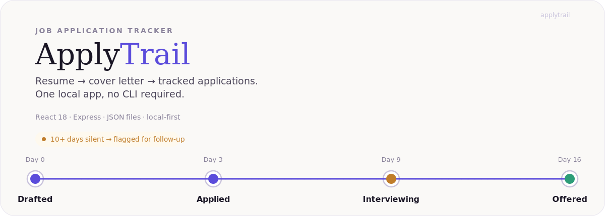
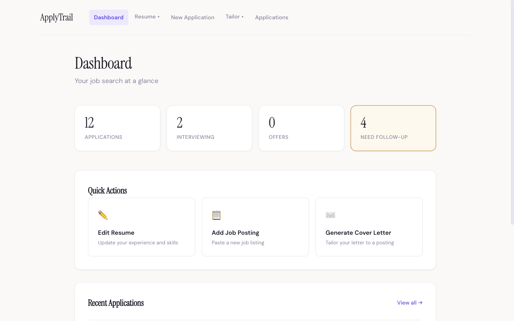
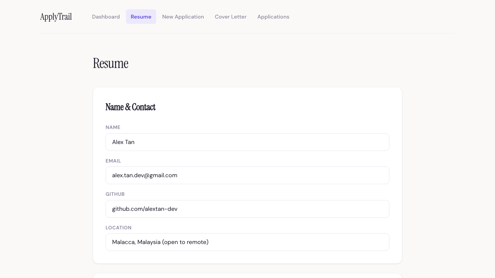
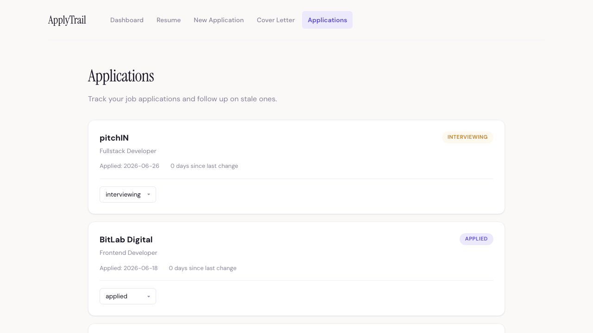

<p align="center">
  
</p>

<p align="center">
  <a href="https://react.dev/"></a>
  <a href="https://expressjs.com/"></a>
  <a href="https://nodejs.org/"></a>
  <a href="https://render.com/"></a>
  <a href="LICENSE"></a>
</p>

<p align="center"><b><a href="https://applytrail.onrender.com">Live demo →</a></b></p>

<br>

<table>
<tr>
<td width="34%" valign="top">

### Every application has a trail

ApplyTrail keeps your resume, your cover letters, and every application you've sent in one place — as plain JSON files on your own disk. Paste a job posting, get a tailored cover letter paragraph, and see at a glance which applications have gone quiet for 10+ days.

No login. No job-board scraping. No cloud account required to start.

</td>
<td width="66%">

</td>
</tr>
</table>

<table>
<tr>
<td width="50%">

<p align="center"><sub>Structured resume editor</sub></p>
</td>
<td width="50%">

<p align="center"><sub>Applications tracked with follow-up alerts</sub></p>
</td>
</tr>
</table>

---

## How it works

1. **Edit your resume** in structured sections — experience, projects, skills, education.
2. **Paste a job posting** with the company and role.
3. **Generate a cover letter paragraph** — matched against your resume by keyword overlap, or by an AI provider if you configure one.
4. **Save the application** and track its status: drafted → applied → interviewing → offered.
5. **Get flagged** when an application has sat untouched for 10+ days.

Cover letter generation defaults to a plain heuristic — no API key, no network call, fully inspectable. Swap in a real LLM any time; see [AI Analysis Providers](#ai-analysis-providers) below.

---

## Getting started

**Prerequisites:** Node.js 18+, npm

```bash
git clone https://github.com/YOUR_USERNAME/applytrail.git
cd applytrail
npm install
npm run dev
```

* Frontend: http://localhost:5173
* API: http://localhost:3000

Demo data is seeded automatically on first launch, so there's something to look at immediately.

---

## AI analysis providers

The default cover letter engine is keyword matching — deterministic, offline, and free. If you want AI-written analysis instead, ApplyTrail supports three providers with automatic fallback between them:

| Provider | Notes |
|----------|-------|
| **Gemini** | Google's fast multimodal model |
| **OpenRouter** | Access to multiple models, including free tiers |
| **Groq** | Ultra-fast inference, free tier available |

```bash
# server/.env
ANALYSIS_PROVIDER=gemini
GOOGLE_GENERATIVE_AI_API_KEY=your_key_here
```

Full setup and fallback order: [AI_PROVIDERS.md](AI_PROVIDERS.md)

---

## Tech stack

| Layer | Technology |
|-------|------------|
| Frontend | React 18, Vite, React Router |
| Backend | Express 4, Node.js |
| Storage | JSON files on disk |
| Styling | CSS Modules |
| Deployment | Render free tier |
| AI Analysis | Vercel AI SDK (Gemini, OpenRouter, Groq) |

<details>
<summary><b>Project structure</b></summary>

```text
.
├── client/                  # React frontend (Vite)
│   └── src/
│       ├── components/      # Reusable UI components
│       ├── pages/           # Route pages
│       ├── App.jsx          # Layout + Router
│       └── main.jsx         # Entry point
├── server/                  # Express API
│   ├── index.js             # API routes + production server
│   ├── data/                # JSON file storage
│   └── demo-data/           # Seed data for first launch
├── docs/
│   └── screenshots/         # App screenshots
├── slides/
│   └── pitch.md             # Marp presentation
├── render.yaml               # Render deployment config
├── package.json              # Root config (concurrently)
├── LICENSE                   # MIT License
└── README.md
```

</details>

<details>
<summary><b>API routes</b></summary>

| Method | Endpoint | Description |
|--------|----------|-------------|
| GET | `/api/resume` | Get resume data |
| PUT | `/api/resume` | Update resume data |
| GET | `/api/job-postings` | List job postings |
| POST | `/api/job-postings` | Create job posting |
| GET | `/api/applications` | List applications |
| POST | `/api/applications` | Save application |
| GET | `/api/health` | Health check |

</details>

<details>
<summary><b>Deployment</b></summary>

The app is deployed on Render free tier using the `render.yaml` blueprint.

To deploy your own instance:

1. Fork this repository
2. Go to [Render](https://render.com) and create a new Blueprint
3. Connect your GitHub account and select the forked repo
4. Render detects `render.yaml` and auto-configures the service
5. Click Apply — the app deploys in 2-5 minutes

Environment variables:

* `NODE_ENV=production` — enables helmet, compression, and static file serving (set in render.yaml)
* `PORT` — auto-set by Render

Data resets on each redeploy (acceptable for a portfolio demo).

</details>

---

## License

MIT — see [LICENSE](LICENSE) for details.
